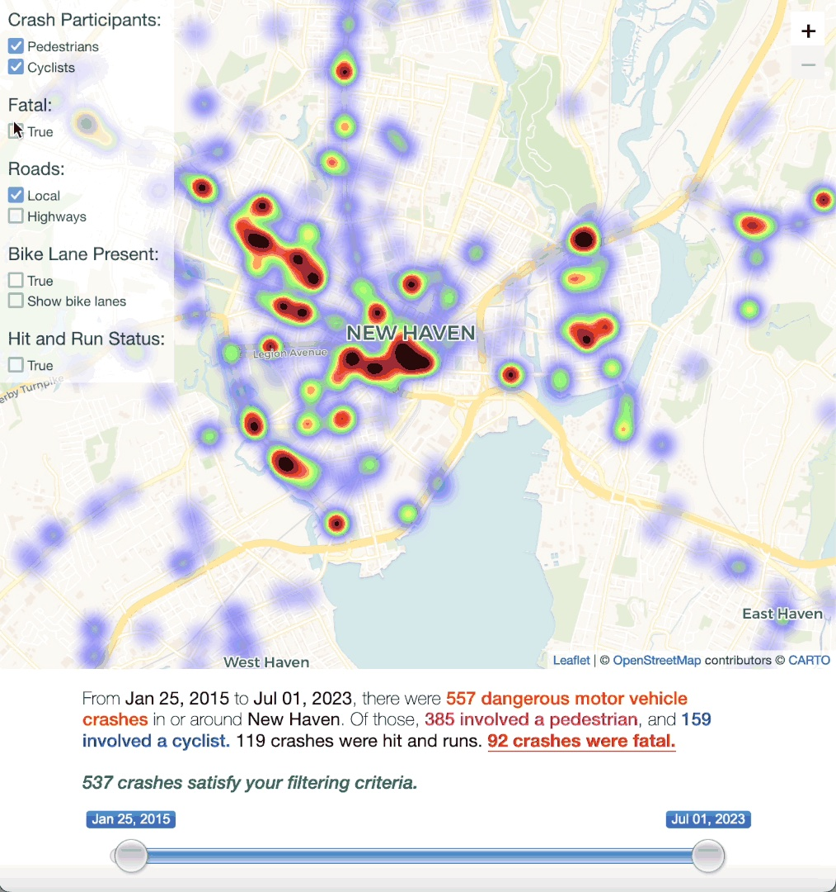

# New Haven Crashes

Interactive heatmap of car crashes involving cyclists and pedestrians from 2015 on.

This project is made for legislators and activists to gain a better understanding of infrastructure in need of redesign.

Displays pre-processed data from [UCONN Crash Data Repository](https://www.ctcrash.uconn.edu/).

MIT License, adapted from 

## License
MIT
